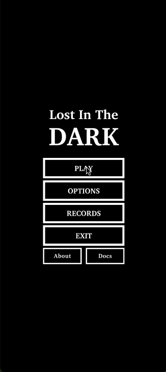
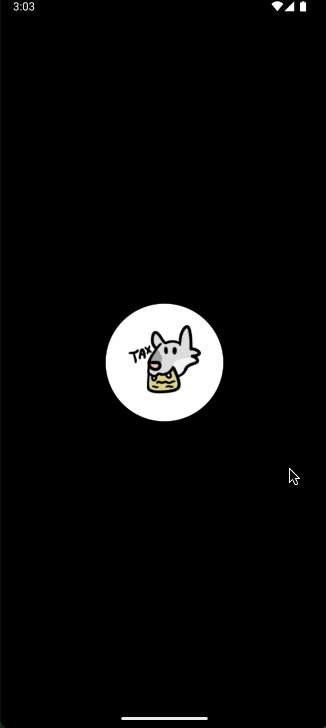
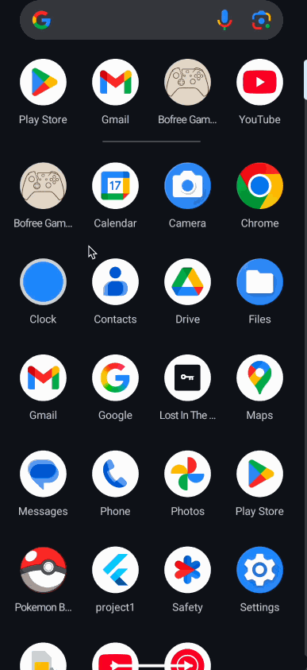
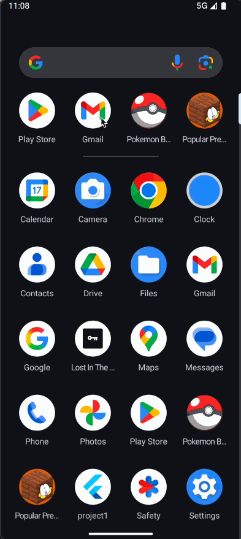

# Project 3 Demo Showcase

A sampling of Project 3 submissions from previous semesters. These aren't refined showcase pieces - just a few demos I had ready to go from the many great projects students have created.

---

## Fall 2024 (2245)

*Game demo*

*Lost in Dark*

*Tax Game*

---

## Fall 2025 (2251) / Spring 2026 (2255)

*Bofree Games*

*Popular Prediction*

---

**Note:** Project 3 can be a game (using Flame engine) or an advanced application. These examples show the variety of what students have built.
