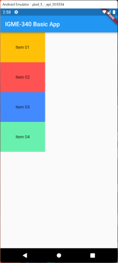
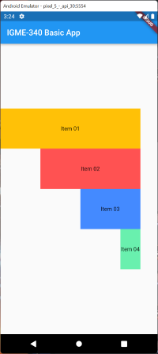
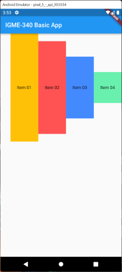

# Flutter ICE 1 - Layout Basics

Welcome to Flutter, now that we've got to work with Dart, and hopefully you have a grasp of its basics, we can now move onto Flutter.

Creating a __Flutter Application__ is similar to creating a __Dart Console Application__. From the __Command Palette__, search for `Flutter: New Project`.

Create a new __Flutter Application__ called `flutter_basics`. Once the project is created, remove all the starter code in the main.dart and replace with the following:

### main.dart
```dart
import 'package:flutter/material.dart';

void main() {
  runApp(const MyApp());
}

class MyApp extends StatelessWidget {
  const MyApp({super.key});

  @override
  Widget build(BuildContext context) {
    return MaterialApp(
      theme: ThemeData(
        primarySwatch: Colors.blue,
      ),
      home: const MyHomePage(),
    );
  }
}

class MyHomePage extends StatefulWidget {
  const MyHomePage({super.key});

  @override
  State<MyHomePage> createState() => _MyHomePageState();
}

class _MyHomePageState extends State<MyHomePage> {
  @override
  Widget build(BuildContext context) {
    return Scaffold(
      appBar: AppBar(
        title: const Text("IGME-340 Basic App"),
      ),
      body: Container(),
    );
  }
}


```
This code will be the basis for the exercise.

---
## Exercise:

1. Modify the `Container` and give it a `height` and `width` of `200` pixels. Run the app.
   
2. Wrap the `Container` in an `Align` Widget and position the `Container` in the center.   

3. Play around with the `Align` widget to move the container around the screen.
   
4. Save your work to a new dart file, call it `basics00.dart`.   

5. Remove the `Align` and `Container` widgets and add a `Column` Widget. Add 4 `Containers` to the `Column`, each `Container` should have the following settings:
   * Height and Width of 150 pixels.
   * Contain Text that is centered with something identifying each Container.
   * Each should be uniquely colored.
   * It should appear as follows:

          

6. Change the flow of the containers to the bottom.
   
7. Save your work in a new dart file, call it `basics01.dart`.

8. Alter the column and containers to make the UI look like the following:

    
   
9.  Save the work to a new file as `basics02.dart`.

10. Convert the `Column` into a Row, and alter settings of the `Row` and `Containers` to create this:
   
        

11. Save the work to a new file, `basics03.dart`.
    
12. Change the `Row` back into a `Column` and clear out the children. Now add in 8 Containers with the following attributes:
 
   * height of 200 
   * Centered Text identifying each container.
   * Unique color for each container.

    Also make the containers fill the entire width of the column. 
    Run the program, you should see the contents have overflown the bounds, Fix this problem (hint, it's not by shrinking any of the containers. Internet search for a potential solution with another widget).
    
13. Save the work to a new file, `basics04.dart`.

Zip all dart files and submit to the dropbox.
