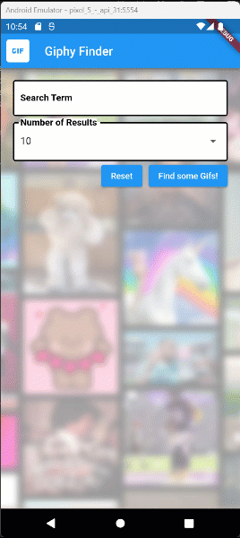

# Lab 02: GIF Finder

> This is our last Homework / Lab! After this all we have left is two LARGE projects so use your time wisely! Generally a 3 credit class you expect to put in 6 to 9 hours of outside class work per week. This time should be spent working on your projects!

## I. Overview
This lab is designed to further your skills in Flutter, this time we will be using a GridView and using Flutter's HTTP functionality to call a restful API. The API, GIPHY, should be familiar since you all should have gone through IGME-230/235. This time, we're going to make GIF Finder in a Flutter App.
The plan will be I will walk you through the initial part of the lab, and you will be assigned extra activities to expand on the applications capabilities.

---

## II. Requirements
The application will start off as below



### The functional requirements are:
* Create __1__ TextField with the following criteria
  * Have a label showing what this field is.
  * Apply Border to the TextField.
  * Ensure Validation for some text to be entered into the field.
  
* Create a Dropdown containing number of desired results.
* Create __2__ buttons, `Reset` and `Find some Gifs!`. 
  * __Find some Gifs!__ performs form validation and dismisses the on-screen keyboard.
  * __Reset__ clears all the fields, the text area and resets the Dropdown to its default value. Also clear out the grid results.

---

## III. Getting Started with GIPHY API

Before you begin coding, you'll need your own GIPHY API key.

> **📖 API Setup Guide:** See the complete [GIPHY API Setup Reference](../reference/network/giphy-api-setup.md) for detailed instructions on:
> - Creating your GIPHY developer account
> - Generating an API key (choose "API" not "SDK")
> - Understanding rate limits and best practices
> - Testing your API key before coding
> - **Important:** Keep your API key secure - don't share it or commit it to public repositories!

**Quick Start:**
1. Go to [GIPHY Developers Dashboard](https://developers.giphy.com/)
2. Create an account and click "Create an App"
3. Choose **"API"** (not SDK) and select **"Other"** as platform
4. Your API key will be generated - save it securely!

### Helpful GIPHY Endpoints for This Lab

You'll primarily use the **Search** endpoint, but here are some useful ones:

**Search GIFs** (Required for core functionality):
```
https://api.giphy.com/v1/gifs/search?api_key=YOUR_KEY&q=SEARCH_TERM&limit=25
```

**Trending GIFs** (Useful for Task #6 - startup loading):
```
https://api.giphy.com/v1/gifs/trending?api_key=YOUR_KEY&limit=10
```

**Random GIF** (Alternative for Task #6):
```
https://api.giphy.com/v1/gifs/random?api_key=YOUR_KEY&tag=funny
```

**Tips:**
- Test endpoints in browser or [Hopscotch](https://hoppscotch.io/) first!
- Use the debugger to explore the JSON response structure before parsing
- The `limit` parameter controls how many results you get (max 50)
- All GIF data is wrapped in a `data` array in the response

See the [GIPHY API Setup Reference](../reference/network/giphy-api-setup.md) for complete endpoint documentation and response structure examples.

---

## IV. Your Tasks
1. **Obtain your own Giphy API Key** - See [Section III above](#iii-getting-started-with-giphy-api) or the [full API setup guide](../reference/network/giphy-api-setup.md)
2. Add an addtional search option (Your choice), since Giphy will return more data than we are using.
3. Make the results clickable to show a larger version of the GIF and more of the meta data.
4. Show the number of results found.
5. Customize the app with a custom font.
6. On startup load a random GIF or show what's trending.
   
~~7. Somewhere in the application, allow the user to go to the Giphy website for the result.~~
EDIT 10/20/25 I realize #7 could have been problematic since we didn't cover URL opening. I am open to making that a bonus for those who figured it out.


---

### Bonus points
There are many things that can be done to enhance this application, these are some bonus tasks, if you choose to go above and beyond.
1. Save a selected GIF to the device photo gallery.
2. Save the users previous results. (Note: this would be possible with [Shared Prefences](../reference/data-persistence/shared-preferences.md) which we don't cover till week 9 after this is due but if you wish to browser ahead you're welcome to)
3. Impress me with your mad Flutter skills!
