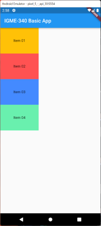
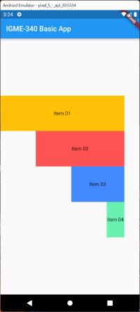
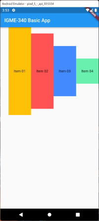

# Lab 01: Layout Basics

## Helpful References
- [Container Basics](../reference/widgets/container-basics.md) - Container properties and styling
- [Layout Widgets](../reference/widgets/layout-widgets.md) - Column, Row, and alignment
- [SingleChildScrollView](../reference/widgets/singlechildscrollview.md) - Fixing overflow issues
- [Week 3A Notes](../weekly/3A.md) - Container, Column, Row covered in class

---

Welcome to Flutter, now that we've got to work with Dart, and hopefully you have a grasp of its basics, we can now move onto Flutter.

Up to now you have been writing Dart in DartPad. This is your first real Flutter project. From the __Command Palette__, search for `Flutter: New Project`.

Create a new __Flutter Application__ called `flutter_basics`. Once the project is created, remove all the starter code in the main.dart and replace with the following:

### main.dart
```dart
import 'package:flutter/material.dart';

void main() {
  runApp(const MyApp());
}

class MyApp extends StatelessWidget {
  const MyApp({super.key});

  @override
  Widget build(BuildContext context) {
    return MaterialApp(
      theme: ThemeData(
        colorScheme: ColorScheme.fromSeed(seedColor: Colors.blue),
      ),
      home: const MyHomePage(),
    );
  }
}

class MyHomePage extends StatelessWidget {
  const MyHomePage({super.key});

  @override
  Widget build(BuildContext context) {
    return Scaffold(
      appBar: AppBar(
        title: const Text("IGME-340 Basic App"),
      ),
      body: Container(),
    );
  }
}


```
This code will be the basis for the exercise.

---
## Before You Start: Align, and the two things called "alignment"

Steps 2 and 3 use the `Align` widget. In class we mostly used `Container`'s `alignment` property, which looks similar and is not the same thing. Worth thirty seconds now so step 3 makes sense.

- **`Container(alignment: ...)`** positions the container's **child inside the container**. The container itself does not move.
- **`Align`** is a widget you wrap **around** something to position **it inside its parent's space**.

Both take the same `Alignment` values, and those values are just coordinates:

```dart
Alignment(-1, -1)  // top left
Alignment( 0,  0)  // dead center, same as Alignment.center
Alignment( 1,  1)  // bottom right
```

`x` runs left to right and `y` runs top to bottom, both from -1 to 1. Every named constant is shorthand for a pair: `Alignment.topCenter` is `Alignment(0, -1)`, `Alignment.centerRight` is `Alignment(1, 0)`.

That is why step 3 says to play around. You can pass any pair you want, including `Alignment(0.3, -0.6)`, so the named constants are a convenience rather than the whole list of options.

```dart
Align(
  alignment: Alignment.center,
  child: Container(...),
)
```

---

## Exercise:

1. Modify the `Container` and give it a `height` and `width` of `200` pixels, plus a `color` so you can actually see it. A `Container` with a size but no color renders nothing, so a blank screen here means you skipped the color, not that you broke something. Run the app.
   
2. Wrap the `Container` in an `Align` Widget and position the `Container` in the center.   

3. Play around with the `Align` widget to move the container around the screen.
   
4. Save your work to a new dart file, call it `basics00.dart`.   

5. Remove the `Align` and `Container` widgets and add a `Column` Widget. Add 4 `Containers` to the `Column`, each `Container` should have the following settings:
   * Height and Width of 150 pixels.
   * Contain Text that is centered with something identifying each Container.
   * Each should be uniquely colored.
   * It should appear as follows:

          

6. Change the flow of the containers to the bottom.
   
7. Save your work in a new dart file, call it `basics01.dart`.

8. Alter the column and containers to make the UI look like the following:

    
   
9.  Save the work to a new file as `basics02.dart`.

10. Convert the `Column` into a Row, and alter settings of the `Row` and `Containers` to create this:
   
        

11. Save the work to a new file, `basics03.dart`.
    
12. Change the `Row` back into a `Column` and clear out the children. Now add in 8 Containers with the following attributes:
 
   * height of 200 
   * Centered Text identifying each container.
   * Unique color for each container.

    Also make the containers fill the entire width of the column. 
    Run the program, you should see the contents have overflown the bounds, Fix this problem (hint, it's not by shrinking any of the containers. Internet search for a potential solution with another widget).
    
13. Perform a `flutter clean`, zip up your app and submit to the Assignment dropbox. Your app should be pretty small after running these commands! I may make a submission guide / video if I can find time BUT if you  have questions please let me know.

[Comprehensive Guide on submitting your flutter projects to mycourses](../submission-guidelines.md)

Attribution: This HW was originally developed by Dower Chin. I copied the repo to make subtle changes but want to give proper credit!

