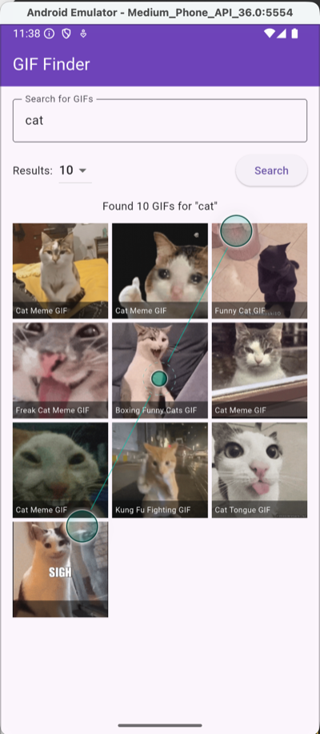

# Lab 04: GIF Finder

> **This lab works differently from Labs 01 to 03.** It walks you through building the app step by step, more like a tutorial. That's on purpose. The search function you write here has the same shape as the one you'll need for Project 2, whatever API you pick, so I want everyone to leave with one that works and that they understand. The last part, showing your results as a grid of GIFs, is yours to figure out.
>
> This is also our last lab. After this it's Projects 2 and 3.

## Helpful References
- [GIPHY API Setup](../reference/network/giphy-api-setup.md): getting a key, the search endpoint, what comes back
- [Week 7B Notes](../weekly/7B.md): async/await, `http.get`, try/catch, shaping API data for the screen
- [Week 8B Notes](../weekly/8B.md): GIPHY in Flutter and `GridView.builder`
- [GridView Reference](../reference/widgets/gridview-basics.md)

---

## I. Overview

You'll build GIF Finder. Type a search term, pick how many results you want, press Search, and see GIFs from GIPHY in a grid.



That's one way the grid can look. How yours looks is up to you (more on that in Part 3).

| Part | What you do | How much help you get |
|---|---|---|
| **1. The form** | Search field, results dropdown, Search button, status line | Code given. It's review, so copy it, but read it |
| **2. The search function** | Build the URL, call GIPHY, handle errors, clean up the data | Every line explained. This is the part that carries into Project 2 |
| **3. The grid** | Build the grid that shows the GIFs, and make it look good | On your own, from a plan rather than code, using 8B |
| **Bonus (+1)** | Block empty searches | On your own |

Parts 1 and 2 only use what we've covered through 7B, so you can do them now. Part 3 needs `GridView`, which is 8B.

---

## II. Get the Starter

1. Go to the [Lab 04 starter repo](https://github.com/IGME-340/lab04_starter).
2. Either click **Code → Download ZIP**, or click **Use this template** to make your own copy on GitHub. If you use the template, set your copy to **Private**. Your API key is going to end up in this code.
3. In VS Code, open the folder that **contains `pubspec.yaml`**. Opening the folder above it is the most common way this goes wrong, and the error you get won't tell you that.
4. Run it. You should see a purple app bar that says GIF Finder and an empty screen.

Two things are already set up in the starter: the `http` package is installed, and the macOS network permission is turned on. In Project 2 you'll start your own project, so you'll do both of those yourself. Adding `http` is the `flutter pub add http` we did in [7B](../weekly/7B.md), and the macOS permission is the [bonus section in 8B](../weekly/8B.md#macos-network-permission-issue--bonus-content).

---

## III. Get Your Own GIPHY API Key

Everyone needs their own key. Each key only gets so many calls per hour, so if a bunch of people share one, it runs out in the middle of somebody's testing.

Follow [Getting Your API Key](../reference/network/giphy-api-setup.md#getting-your-api-key) in the GIPHY reference. The short version: make an account at [developers.giphy.com](https://developers.giphy.com/), click **Create an App**, choose **API** (not SDK), and pick **Other** for the platform.

Keep the key handy. You'll paste it in at Step 9.

---

## IV. Part 1: The Form

Everything in this part is review from 6A, 7A, 7B, and Lab 03, so the code is here for you to copy. Do read each block before moving on, though. Part 2 uses all of it.

Everything goes in `lib/main.dart`.

### Step 1: The form's variables

**Where:** inside `_MainPageState`, above `build()`.

```dart
class _MainPageState extends State<MainPage> {   // already there
  final TextEditingController searchController = TextEditingController();

  // Strings, not ints, because they go straight into the URL.
  List<String> limitList = ["10", "25", "50"];
  String? selectedLimit = "25";
```

`searchController` is how we read what's typed in the search field. `limitList` and `selectedLimit` are for the dropdown that sets how many results we ask GIPHY for.

### Step 2: dispose()

You just made a `TextEditingController`, so it needs to be cleaned up when the screen goes away. You've written one of these before. Add a `dispose()` method under your variables that disposes `searchController`.

If you need a reminder, it's in [6A, TextEditingController](../weekly/6A.md#texteditingcontroller---power-user-features).

### Step 3: The search field

**Where:** the starter's `body` is a `Padding` with an empty `Column`. This goes inside the Column's `children`, replacing the comment.

```dart
          children: [   // already there
            TextField(
              controller: searchController,
              decoration: InputDecoration(
                labelText: "Search for GIFs",
                border: OutlineInputBorder(),
              ),
            ),
```

Run it. You should see an outlined search field.

### Step 4: The results dropdown

**Where:** right under the TextField, still inside `children`.

```dart
            SizedBox(height: 12),
            Row(
              children: [
                Text("Results:"),
                SizedBox(width: 8),
                DropdownButton(
                  value: selectedLimit,
                  items: limitList.map((String item) {
                    return DropdownMenuItem(value: item, child: Text(item));
                  }).toList(),
                  onChanged: (value) {
                    setState(() {
                      selectedLimit = value;
                    });
                  },
                ),
              ],
            ),
```

This is the 6A dropdown: `.map()` turns each String in `limitList` into a menu item. It's in a `Row` because the Search button goes next to it.

Run it. Pick 10 or 50 and the dropdown should change.

### Step 5: The Search button

**Where:** inside the Row's `children`, right after the DropdownButton.

```dart
                ),   // end of the DropdownButton, already there
                Spacer(),
                ElevatedButton(
                  onPressed: () {
                    debugPrint("Search pressed");
                  },
                  child: Text("Search"),
                ),
```

`Spacer` takes up all the leftover room in the Row, which pushes the button to the right edge.

Run it. Press Search and look for "Search pressed" in the Debug Console.

### Step 6: Variables for the results

**Where:** up top with your other variables, under `selectedLimit`.

```dart
  List<Map<String, dynamic>> gifList = [];
  String statusText = "Type something and press Search.";
```

`gifList` will hold the search results. Each result will be a small Map with a `title` and an `imageUrl`. `statusText` is how the app tells the user what's going on.

### Step 7: The status text

**Where:** at the bottom of the Column's `children`, after the Row.

```dart
            SizedBox(height: 12),
            Text(statusText),
```

Run it. You should see "Type something and press Search." under the form. Pressing Search doesn't do anything yet. That's Part 2.

Notice there's nothing on screen for `gifList` yet. Showing the results is Part 3, and that part is yours.

---

## V. Part 2: The Search Function

Here's where things slow down. Every line in this part gets explained, because you'll write this same function again in Project 2 with a different API. The goal is that you could rebuild it without this page open.

The function does six things, in this order:

1. Build the URL from what the user typed and picked
2. Send the request
3. Check whether GIPHY said yes
4. Catch the case where there's no answer at all
5. Pull the parts we need out of the JSON
6. Hand them to the screen with `setState`

### Step 8: An empty function, hooked up to the button

**Where:** inside `_MainPageState`, under your `dispose()`.

```dart
  /// Builds the search URL, calls GIPHY, and keeps only the title and image URL of each GIF.
  Future<void> searchGifs() async {

  }
```

It's `async` because it will wait on the network. It returns `Future<void>` because it doesn't hand back a value. It updates the state instead.

Now point the button at it. **Where:** the `onPressed` of your ElevatedButton, replacing the `debugPrint`.

```dart
                ElevatedButton(   // already there
                  onPressed: () async {
                    // Hide the keyboard so it isn't covering the results.
                    FocusManager.instance.primaryFocus?.unfocus();
                    await searchGifs();
                  },
```

The `unfocus()` line is from [7A](../weekly/7A.md#method-1-focus-manager-on-button-press). On a phone, the keyboard would otherwise sit right on top of your results.

### Step 9: Imports and your key

**Where:** the very top of `main.dart`, under the material import.

```dart
import 'package:flutter/material.dart';   // already there
import 'dart:convert';
import 'package:http/http.dart' as http;

// Paste your own key from developers.giphy.com here.
const String apiKey = "YOUR_API_KEY";
```

`dart:convert` gives us `jsonDecode`, and `http` is what makes the request. Paste your key over `YOUR_API_KEY`, keeping the quotes.

You'll see "unused import" warnings on those two lines until we use them in the next couple of steps. That's fine.

### Step 10: Build the URL

Most web APIs work the same basic way: your request goes in the URL. Here's GIPHY's search URL, straight from their docs:

```
https://api.giphy.com/v1/gifs/search?api_key=YOUR_KEY&q=cats&limit=25
```

Everything after the `?` is a parameter written as `name=value`, and the parameters are separated by `&`.

| Parameter | What it is | Where ours comes from |
|---|---|---|
| `api_key` | who's asking | the `apiKey` constant |
| `q` | the search term | the TextField, through `searchController.text` |
| `limit` | how many results | the dropdown, through `selectedLimit` |

So building the URL means dropping our values into that pattern.

**Where:** inside `searchGifs()`.

```dart
  Future<void> searchGifs() async {   // already there
    // encodeComponent makes spaces and symbols URL-safe, so "funny cat" works.
    String term = Uri.encodeComponent(searchController.text.trim());
    String url =
        "https://api.giphy.com/v1/gifs/search?api_key=$apiKey&q=$term&limit=$selectedLimit";
    debugPrint(url);
```

- `.trim()` cuts spaces off the ends, so `cats ` searches for `cats`.
- `Uri.encodeComponent` rewrites characters that would break a URL. A space becomes `%20`. An `&` becomes `%26`, which matters, because a raw `&` in the search term would look like the start of a new parameter.
- `debugPrint(url)` puts the finished URL in the Debug Console so you can check it.

**Checkpoint.** Run it, search for `funny cat`, and copy the URL out of the Debug Console. Paste it into your browser or [Hoppscotch](https://hoppscotch.io/). You should get a wall of JSON. If you do, your URL is right.

> **Remember this one for Project 2.** When your app isn't showing results, print the URL and try it in the browser. If the browser gets data, the problem is in your Flutter code. If it doesn't, the problem is the URL.

> **Looking ahead:** Project 2 needs at least 3 controls, and each control usually becomes one more parameter in the URL. Once you have that many, you'll probably want to pull this part into its own function, something like `String buildSearchUrl()`, so `searchGifs()` stays readable.

### Step 11: Send the request and check the answer

**Where:** under `debugPrint(url);`.

```dart
    var response = await http.get(Uri.parse(url));

    if (response.statusCode == 200) {
      debugPrint("It worked!");
    } else {
      setState(() {
        statusText = "Error ${response.statusCode}. Check your API key.";
      });
    }
```

- `Uri.parse` turns our String into the `Uri` that `http.get` wants.
- `await` pauses right here until GIPHY answers. That's why the function had to be `async`.
- A status code of `200` means success. Anything else means GIPHY answered but said no. The one you're most likely to see is `401`, which means the key is wrong.

**Checkpoint.** Run it and search. You should see "It worked!" in the Debug Console. Then break it on purpose: change one letter of your key, search again, and you should see `Error 401` in the app. Change it back.

### Step 12: Wrap it in try/catch

The status code covers the case where GIPHY answers with bad news. Sometimes there's no answer at all, though: no internet, the wifi drops, the emulator loses its connection. When that happens, `http.get` doesn't give you a status code. It throws an exception, and if nothing catches it, your Search button just looks dead.

That's what try/catch is for. We tried it in DartPad in [7B](../weekly/7B.md#error-handling-with-try-catch); this is the real version.

**Where:** wrap everything from `var response` to the end of the if/else. Here's the whole function so far, so you can see the shape:

```dart
  Future<void> searchGifs() async {
    // encodeComponent makes spaces and symbols URL-safe, so "funny cat" works.
    String term = Uri.encodeComponent(searchController.text.trim());
    String url =
        "https://api.giphy.com/v1/gifs/search?api_key=$apiKey&q=$term&limit=$selectedLimit";
    debugPrint(url);

    // try/catch AND a status check, because they catch different failures:
    // a status code means GIPHY answered "no"; an exception means no answer at all (no internet).
    try {
      var response = await http.get(Uri.parse(url));

      if (response.statusCode == 200) {
        debugPrint("It worked!");
      } else {
        setState(() {
          statusText = "Error ${response.statusCode}. Check your API key.";
        });
      }
    } catch (err) {
      debugPrint("Error: $err");
      setState(() {
        statusText = "Something went wrong. Check your internet connection.";
      });
    }
  }
```

The `catch` does two jobs. It prints the real error for you, the developer, and it shows a plain message for the user. Project 2's rubric looks for exactly this: user-friendly error messages, not crashes or silent failures.

**Checkpoint.** Turn off your computer's wifi (or put the emulator in airplane mode), search, and you should see "Something went wrong." Turn it back on.

### Step 13: Look at what GIPHY sent back

Before pulling anything out of the JSON, look at its shape. Here's one search response, trimmed way down:

```text
{
  "data": [
    {
      "title": "Ice Cream Cats GIF",
      "rating": "g",
      "images": {
        "fixed_width": { "url": "https://media1.giphy.com/...", "size": "2192922", ... },
        "fixed_width_downsampled": { "url": "https://media1.giphy.com/...", ... },
        ... about 20 more sizes of the same GIF
      },
      ... about 20 more fields
    },
    ... one of these per GIF
  ],
  "pagination": { "total_count": 500, "count": 25, "offset": 0 },
  "meta": { "status": 200, "msg": "OK" }
}
```

The paths we care about:

| What | Path |
|---|---|
| The list of GIFs | `jsonResponse['data']` |
| One GIF's title | `gif['title']` |
| One GIF's image | `gif['images']['fixed_width_downsampled']['url']` |

Why `fixed_width_downsampled` and not plain `fixed_width`? The plain GIFs average around 1.6 MB each, so 25 of them is about 40 MB every time you search, and the emulator will crawl. The downsampled ones drop some frames and come in around 2 MB for all 25.

Want to see the full thing? The browser tab from Step 10 has it. The [GIPHY reference](../reference/network/giphy-api-setup.md#understanding-the-response) walks through it too.

**Where:** replace `debugPrint("It worked!");` with:

```dart
        var jsonResponse = jsonDecode(response.body);
```

`jsonDecode` turns the response text into Dart Maps and Lists you can use square brackets on.

### Step 14: Clean up the data

GIPHY sends a couple dozen fields per GIF, and our screen uses two. So we build our own list with just those two.

You've seen this before. In 7B it was called `tempList` (see [Why bother building your own data structure?](../weekly/7B.md#why-bother-building-your-own-data-structure)). Here it gets a name that says what it holds: `cleanedGifs`.

**Where:** right under `var jsonResponse = ...`.

```dart
        List<Map<String, dynamic>> cleanedGifs = [];
        for (final gif in jsonResponse['data']) {
          cleanedGifs.add({
            'title': gif['title'],
            // The downsampled version: 25 full-size GIFs is ~40 MB, these are ~2 MB total.
            'imageUrl': gif['images']['fixed_width_downsampled']['url'],
          });
        }
```

- The `for` loop walks through every GIF in `data`.
- For each one, it builds a small Map with only the two keys our screen needs, using the paths from Step 13.
- Each small Map gets added to `cleanedGifs`.

> **Project 2 heads-up:** GIPHY is tidy. Every GIF has a title and an images block. A lot of APIs aren't like that. They leave a field out when there's no data for it, and a missing field is a missing key, which gives you `null` ([dart-03, Missing keys give you null](../exercises/dart-03-Maps.md#4-missing-keys-give-you-null)). When you build your own cleaned list in P2, that's where `??` comes in.

### Step 15: Hand it to the screen

**Where:** right under the `for` loop.

```dart
        setState(() {
          gifList = cleanedGifs;
          statusText =
              "Found ${gifList.length} GIFs for \"${searchController.text}\"";
        });
```

We build the whole list first and then swap it in with one `setState`, so the screen redraws once with the finished list instead of once per GIF.

**Checkpoint.** Run it and search for `cats`. The status text should say "Found 25 GIFs for "cats"". Set the dropdown to 10 and search again, and it should say 10.

Want to see the data itself? Add `debugPrint(cleanedGifs[0].toString());` right under the `for` loop, search for `cats` again, and look in the Debug Console. You should see one GIF's title and its image URL. That's everything the grid in Part 3 needs. Delete the line when you're done.

---

## VI. Part 3: Build the Results Grid

This part is yours. Your search works and `gifList` is full of titles and image URLs. Now show them: a grid of the actual GIFs, each with its title.

Here's the shape of it, written as a plan instead of code. Turning a plan like this into widgets is exactly what you'll be doing in Project 2.

```text
At the bottom of the Column, under the status text:

  Expanded   (the grid has to be told how much room it gets, same as the list in 7B)
    GridView.builder
      gridDelegate:  a fixed number of columns (try 3), with a little spacing
      itemCount:     how many GIFs are in gifList
      itemBuilder:   for the GIF at this index...
        GridTile
          child:   the GIF itself, from its imageUrl, filling the cell
          footer:  the GIF's title, small, with a background so it's readable over the image
```

**Requirements:**
- A `GridView.builder` that shows every GIF in `gifList`
- Each cell shows the GIF itself, not its URL
- Each GIF's title shows in or under its cell, and you can actually read it
- The status text still shows how many GIFs were found
- Make it look good. The plan above is a starting point, not the finish line. Column count, spacing, colors, and where the title sits are your call.

**Where to look:**
- `GridView.builder`, `gridDelegate`, and `GridTile` are all in [8B, GridView.builder](../weekly/8B.md#gridviewbuilder--dynamic-content) and [8B, GridTile](../weekly/8B.md#gridtile-for-structured-items), plus the [GridView reference](../reference/widgets/gridview-basics.md).
- Showing an image from a URL is `Image.network`, which we used in [4A](../weekly/4A.md). See the [Images reference](../reference/widgets/images-assets.md) too. Its `fit` property controls how the image fills the cell.
- A GIF with a blank title isn't a bug. Some GIFs on GIPHY just don't have one.
- This is a change to the widgets only. Your `searchGifs()` function shouldn't change at all. If you find yourself editing it, back up.

---

## VII. Bonus (+1): No Empty Searches

Try searching with nothing in the box. It doesn't crash. GIPHY just sends back nothing, and you get "Found 0 GIFs for """. Not great for the user.

For a bonus point, stop empty searches before they ever reach GIPHY, and put a message in the status text instead (something like "Please enter a search term first.").

Project 2 requires this, so it's worth figuring out now. Hint: the check belongs at the very top of `searchGifs()`, before the URL gets built.

If you do the bonus, say so in the dropbox comment box when you submit.

---

## Comment Your Code

Three rules, and they apply to every lab and project this semester:

- A header block at the top of every `.dart` file: what it does, your name, the date
- One line above every function saying what it does
- One line on anything non-obvious saying **why**

Labs are graded lightly on this. You'll get feedback rather than deductions, so use them to
build the habit before it starts costing you points on the projects. See the
[Commenting Guide](../commenting_guide.md) for examples.

The starter's header block has `YOUR NAME` and `TODAY'S DATE` in it. Fill those in.

---

## VIII. Submission

1. **Leave your API key in.** Whoever grades it needs your key to run your app.
2. Run `flutter clean` in your project's terminal. Without it your project is hundreds of MB and the upload will fail.
3. Put your project folder inside a folder named `LastName_FirstName_Lab04`.
4. Zip that folder and upload it to the Lab 04 dropbox in MyCourses.
5. Did the bonus? Say so in the comment box.

[Comprehensive Guide on submitting your flutter projects to mycourses](../submission-guidelines.md)

Attribution: based on the original GIF Finder lab by Dower Chin.
