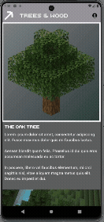

# Project 1: Design to Spec

## Helpful References
- [BoxDecoration](../reference/styling/box-decoration.md) - Gradients, borders, shadows, and background images
- [Images & Assets](../reference/widgets/images-assets.md) - Loading local images, pubspec.yaml setup
- [SVG Images](../reference/assets/svg-images.md) - Using the PickAxe SVG with flutter_svg
- [Dialogs & Alerts](../reference/navigation/dialogs-alerts.md) - Popup dialogs for About and item info
- [InkWell & GestureDetector](../reference/widgets/inkwell-gesturedetector.md) - Making items clickable
- [SingleChildScrollView](../reference/widgets/singlechildscrollview.md) - Scrollable text regions
- [Stack Widget](../reference/widgets/stack-widget.md) - Layering widgets (alternative approach)
- [Week 4A Notes](../weekly/4A.md) - Image in Container with gradient background (DecorationImage)
- [Week 4B Notes](../weekly/4B.md) - Dialogs and InkWell

---

## I. Overview
Application developers commonly work in a team with others such as Content Strategists, User Experience designers, and Graphic Artists.  For this project, you are being asked to create this application based on a mockup animation.  Your Goal is to use Flutter to make the animation a reality.

## II. Requirements
You are to recreate this application:

(See the zip starter file for better resolution "end product" screenshots and mp4 video)
### The functional requirements are:

* AppBar should have an `About` button that shows a popup with credits.
* The `background` is static, but it could scroll if desired, that's up to you.
* The `oak tree` image has a transparent background, you will need to create the gradient yourself, DO NOT MODIFY the image.
* Each item text box needs to scroll if the information is too large.
* Each item (ex, planks), needs to be clickable and show a popup with more information. The text should also be scrollable if the information does not fit.

This is decidedly __NOT__ a Project for you to exercise your *design* creativity. (maybe your coding creativity, however)

You will be graded on how close you are able to get your page to the appearance of this demo animation.

Source image files, fonts, palette, and reference images/animations to work with are available here: [flutter_design_to_spec_assets.zip](https://github.com/lucidchin/IGME-340-Shared/blob/main/projects/support_files/flutter_design_to_spec_assets.zip)

This is an individual project, and since everyone is doing the EXACT SAME design, you should guard your code carefully so that it is not made available to others.  There is enough ambiguity in the design and the ways that it gets implemented that everyone's project can certainly be unique.

The application, at this time, does not need to be responsive and the target devices will be in portrait mode. The application will be tested on an **Android Medium Phone** emulator with the following specs:

| Property | Value |
|----------|-------|
| Resolution | 1080 x 2400 |
| Density | 420 dpi |
| Screen size | 6.4" |
| API | 36.0 (Android 16) |

As long as your layout fits on this screen without overflow errors, you're good. It does not need to be fluid or adapt to other screen sizes — we'll cover responsive layout techniques later in the course.

QUESTIONS?  It is not uncommon to need to ask questions of the Customer, or design team so that you get the clearest understanding of the spec.  For the purposes of this assignment, the Customer/Design Team  will be your course Instructor and spec clarification questions should be asked in YOUR SECTION'S Slack channel. Be careful not to share your (complete or mostly complete) code to the rest of the class.

If you run into trouble and wish to seek help with a specific question that requires the sharing of your code, do so through a DM to your Instructor.

## III. NON Requirements
- You do not need to guess at page colors.  They are all (except for white and black) specified in included color palette.  
- The fonts have been provided for you, but you are free to use similar fonts of your choosing. 
- The PickAxe SVG has been provide for you, so no need to find another one, but you are free to find a substitute if you desire.
- It is not necessary to crop the images in exactly the same way as the original images, however, we are providing the original images so that they can match more easily.  
- You should use the same heading texts that we provided, however you do not need to use the same placeholder text.  Use VS Code or another tool to generate "Lorem Ipsum" text for you to hold the spaces open.  Tip:  In VS Code, just type `loremNN` where NN is a number of words that you want followed by Enter, and it will generate a block of text for you. Likewise, you can use the [Ipsum.com](https://lipsum.com/feed/html) website to generate text.

## IV: Code Organization Bonus (+5 points)
As you build out the item cards (planks, sticks, stairs, chests), you'll notice they all look very similar. This is a great opportunity to practice the **DRY principle** (Don't Repeat Yourself).

Instead of copying and pasting the same widget structure four times with only the label and image changed, consider extracting the repeated code using one of these approaches:

- **Extract Method** — Pull the repeated widget tree into a helper method with parameters (e.g., `buildItemCard(context, label, imagePath, description)`). Quick and easy.
- **Extract Widget** — Create a separate `StatelessWidget` class with constructor parameters. Even cleaner, and you can move it to its own file.

For example, rather than writing separate `plankArea()`, `stickArea()`, `stairsArea()`, and `chestArea()` functions that are nearly identical, you could write a single reusable method or widget and call it four times with different arguments.

We demonstrate both techniques in the **Week 5B** class session — including a trick where VS Code builds the constructor for you automatically.

**This is not required** — you can absolutely complete the project by building each card individually. But if you reduce meaningful code duplication through helper methods or reusable widgets, you'll earn up to **5 bonus points**.

## V: Code Comments
Your code must be commented following the course [Commenting Guide](../commenting_guide.md). This includes a file header block at the top of each file and comment blocks for classes, methods, and any non-obvious logic. Proper commenting is part of your grade on every project.

## VI: Submissions
- Use the `flutter clean` option in a Terminal winodw before zipping up your project for submission. Upload to the assignment on myCourses (when it is created).